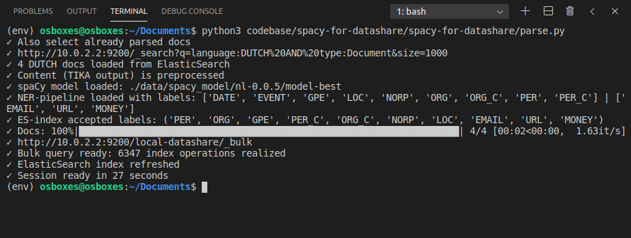

# spacy-for-datashare
Let spaCy do the parsing of Named Entities for documents in the Datashare platform.

The idea: Datashare is a java-based platform that uses [Apache Tika](https://tika.apache.org/) to extract text from documents. After text extraction, a Java-based NLP parser will execute a NER-task to find Named Entities. All documents and Named Enitites are stored in Datashare's Elasticsearch index. Instead of using the standard Java-based NLP-parsers, you can now use your own customized spaCy-models to parse Named Entities!


- [spaCy](www.spacy.io) is a free, open-source library for advanced Natural Language Processing (NLP) in Python
- [Datashare](https://datashare.icij.org/) allows you to better analyze information, in all its forms. It is a free open-source software platform for Mac/Windows/Linux developed by the [International Consortium of Investigative Journalists](www.icij.org)


# Prerequisites
- [install Datashare](https://icij.gitbook.io/datashare/)
- upload documents to Datashare
- make your custom NER-filter visible in Datashare (for details, [look here](https://github.com/ICIJ/datashare/wiki/Client-%E2%80%BA-Plugins))
  - add your plugins-folder location, e.g. `--pluginsDir "C:\Users\Name\AppData\Roaming\Datashare\plugins"` (Windows) to `"C:\program files\Datashare-${VERSION}\datashareStandalone.bat"` 
  - register a new filter via a index.js file in the plugins folder. For examples, see the [plugins folder](./plugins)
- Use Python 3.8 or higher and install these python libraries
  - "tqdm>=4.0.0"
  - "spacy>=2.2.0"
  - "price_parser>=0.3.0"


# Settings
```python
# Your local model or a spacy default model like nl_core_news_sm
SPACY_MODEL = './data/spacy_model/nl-0.0.5/model-best' 

# Preprocess the line-end problems for PDF's extraced by TIKA (as good as possible)
PREPROCESS_TIKA_OUTPUT = True

# Skip already parsed documents
SKIP_ALREADY_PARSED_DOCS = False

# Prevent duplicate enitities after rerunning the script
CLEAN_ENTITIES_BEFORE_UPDATE = True

# Elastic search URL; e.g. for VMbox=10.0.2.2:9200 , for local installation=127.0.0.1:9200
ES_BASE_URL = 'http://10.0.2.2:9200/'

# Named Entity labels; depend on your spaCy model
ACCEPTED_SPACY_LABELS = ('PER', 'ORG', 'GPE', 'PER_C', 'ORG_C', 'NORP', 'LOC', 'EMAIL', 'URL', 'MONEY') 
```


# Steps taken by script
- Get documents from Datashare's ElasticSearch index
- Preprocess raw content (mostly raw TIKA output)
- Parse doc with spaCy
- Delete all old Named Entities that are already in the ES-index
- Get all Named Entities and merge them in Datashare's format
- Bulk index the document updates and new Named Entities to ES-index
- Refresh ES-index




